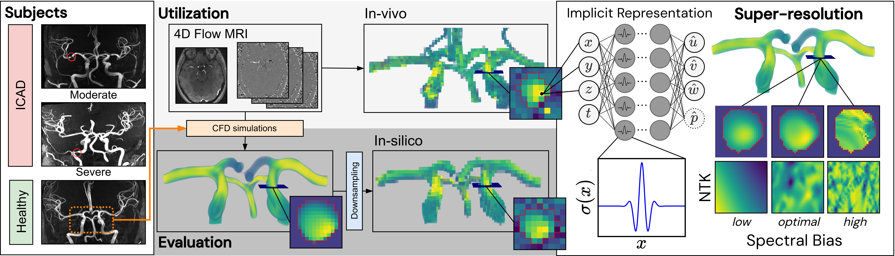
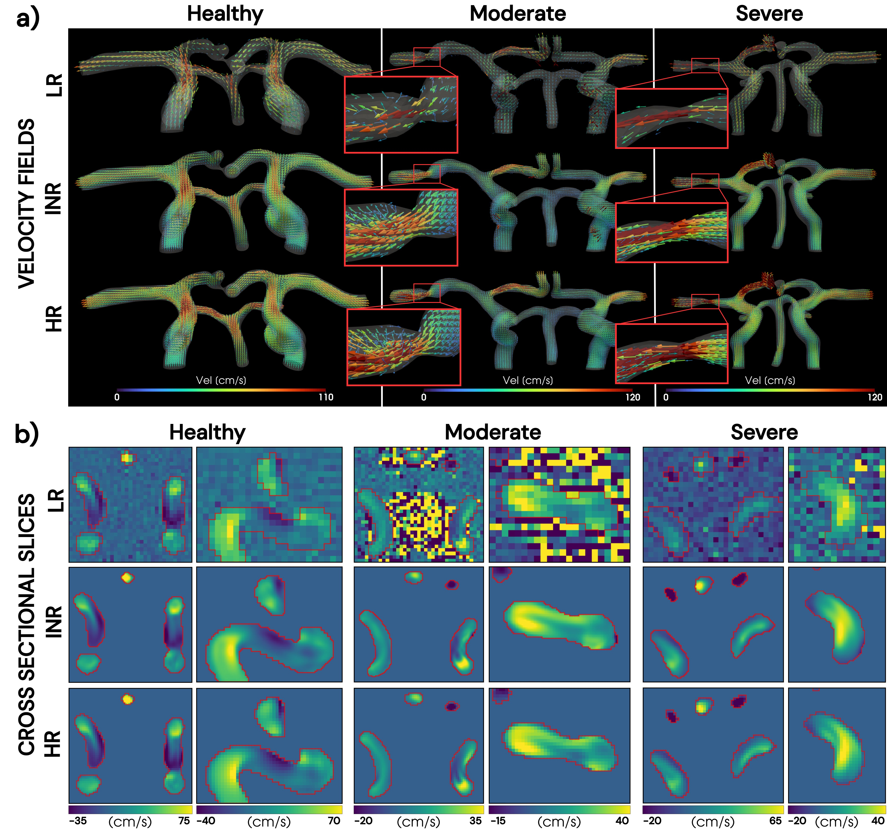

# 4DFlowINR

**Spectrally optimized implicit neural representations for super-resolution and denoising of intracranial 4D Flow MRI**

<p align="center">
  
</p>

4DFlowINR is a PyTorch research framework for patient-specific, coordinate-based reconstruction of time-resolved three-dimensional velocity fields. It implements:

- a fast, data-driven implicit neural representation (INR)
- a physics-informed INR constrained by the incompressible Navier–Stokes equations
- WIRE and SIREN coordinate-network architectures
- arbitrary-grid spatial and temporal querying
- meta-learned initialization for rapid subject-specific adaptation
- neural tangent kernel (NTK) analysis
- experimental self-adaptive PINN extensions
- HDF5 prediction, quantitative evaluation, and ParaView export tools

The repository accompanies the manuscript:

> **Spectrally optimized implicit neural representations mitigate acquisition-related image quality trade-offs in intracranial 4D Flow MRI**

The manuscript evaluates three healthy cases and six cases with intracranial atherosclerotic disease, grouped into moderate and severe stenosis cohorts. The public example data are intended for software demonstration only; the full study datasets are not distributed in this repository.

## Method overview

The network represents velocity as a continuous function of normalized spatiotemporal coordinates,

$$
(t,x,y,z)\longmapsto (u,v,w),
$$

with an additional latent pressure output for the physics-informed model. WIRE Gabor activations provide tunable spectral bias through $\omega_0$ and $s_0$.

The paper configurations use:

| Model | WIRE parameters | Optimization |
|---|---:|---|
| Data-driven INR | $(\omega_0,s_0)=(20,20)$ | Adam, 8,000 iterations, 20,000 data points per iteration |
| Physics-informed INR | $(\omega_0,s_0)=(60,30)$ | Adam for 10,000 iterations, then L-BFGS for 5,000 iterations; 6,000 data and collocation points per iteration |

<p align="center">
  
</p>

## Repository structure

```text
4DFlowINR/
├── example_data/                 # Public demonstration HDF5 data
├── docs/
│   └── NTK_COMPUTATION.md        # NTK implementation details
├── src/
│   ├── configs/
│   │   ├── paper/                # Main paper and meta-learning configurations
│   │   └── extensions/sa_pinn/   # Experimental self-adaptive PINN configurations
│   ├── meta/                     # MAML implementation
│   ├── prepare_data/             # Synthetic-data generation utilities
│   ├── tools/                    # Benchmarking, NTK, and VTK/VTI utilities
│   │   └── sa_pinn/              # Self-adaptive PINN analysis utilities
│   ├── utils/                    # Data, loss, sampling, evaluation, and checkpoint helpers
│   ├── networks.py               # INR architectures
│   ├── train.py                  # Training command-line entry point
│   ├── trainer.py                # Training loop
│   └── predict.py                # Checkpoint inference entry point
├── CITATION.cff
├── LICENSE
├── README.md
└── requirements.txt
```

Some files in the tree above may be added as part of the release-preparation steps described below.

## Installation

The paper experiments were implemented with Python 3.10 and PyTorch 2.2.1. Training was performed on an NVIDIA A100 GPU with 40 GB memory. A CUDA-capable GPU is strongly recommended, particularly for the physics-informed configurations.

### 1. Clone the repository and retrieve Git LFS data

```bash
git lfs install
git clone https://github.com/oliverwelinodeback/4DFlowINR.git
cd 4DFlowINR
git lfs pull
```

### 2. Create an environment

Using `venv`:

```bash
python3.10 -m venv .venv
source .venv/bin/activate
python -m pip install --upgrade pip
pip install -r requirements.txt
```

On an HPC system, install only the packages not already supplied by the PyTorch/CUDA container.

### 3. Configure Weights & Biases

Online experiment tracking:

```bash
wandb login
```

Offline logging:

```bash
export WANDB_MODE=offline
```

Disable W&B logging for a non-sweep run:

```bash
export WANDB_MODE=disabled
```

W&B sweeps require an operational W&B setup. Ordinary training should also be tested in `offline` or `disabled` mode before release.

## Data format

The core input is an HDF5 file containing time-resolved velocity components.

### Required datasets

| Key | Expected shape | Description |
|---|---|---|
| `u` | `(T, X, Y, Z)` | First velocity component |
| `v` | `(T, X, Y, Z)` | Second velocity component |
| `w` | `(T, X, Y, Z)` | Third velocity component |
| `mask` | `(X, Y, Z)` or `(T, X, Y, Z)` | Fluid-domain mask |

### Optional datasets

| Key | Description |
|---|---|
| `p` | Pressure |
| `px`, `py`, `pz` | Reference pressure-gradient components |

When `config.resolution.from_file = True`, the HDF5 file must also contain:

- `spacing`: three spatial spacings in metres;
- `dt`: temporal spacing in seconds.

Dataset orientation is assumed to follow `(T, X, Y, Z)`. Velocity values are expected in m/s.

## Configuration and path conventions

Training is launched from the repository root:

```bash
python src/train.py --config configs/paper/inr.py
```

`src/train.py` resolves the configuration path and then changes the working directory to `src/`. For this reason, paths in the supplied configurations are written relative to `src/`, for example:

```python
config.data_file = "../data/example.h5"
config.networks_folder = "../models/paper_inr"
```

Validate a configuration without starting training:

```bash
python src/train.py \
    --config configs/paper/inr.py \
    --dry-run
```

## Paper configurations

| Configuration | Purpose |
|---|---|
| `src/configs/paper/inr.py` | Data-driven INR paper sweep |
| `src/configs/paper/pinn.py` | Physics-informed INR paper sweep |
| `src/configs/paper/meta_inr.py` | Data-driven MAML training and fine-tuning |
| `src/configs/paper/meta_pinn.py` | Physics-informed MAML training and fine-tuning |

The paper sweep configurations reference study-specific data that are not included in the repository. Update the routing table and file paths only when working with authorized local copies.

For a single subject, copy the relevant paper configuration and set:

```python
config.sweep = False
config.data_file = "../path/to/input.h5"
config.include_ref = False          # True only when an authorized HR reference exists
config.include_ref_loss = False
config.data_file_ref = None
```

Do not modify the paper configurations when testing unrelated data; create a separate configuration instead.

## Training

### Data-driven INR

```bash
python src/train.py \
    --config configs/paper/inr.py
```

The paper configuration launches a W&B sweep over the routed study cases.

### Physics-informed INR

```bash
python src/train.py \
    --config configs/paper/pinn.py
```

This is substantially more computationally demanding because it evaluates higher-order derivatives required by the Navier–Stokes residual and subsequently runs L-BFGS.

### Join an existing sweep

```bash
python src/train.py \
    --config configs/paper/inr.py \
    --sweep-id <ENTITY/PROJECT/SWEEP_ID>
```

## Inference from a checkpoint

```bash
python src/predict.py \
    --config configs/paper/inr.py \
    --checkpoint models/paper_inr/H1_YYYYMMDD-HHMM/checkpoints/paper_inr_it008000.pth \
    --data-file example_data/example_LR.h5 \
    --output-dir predictions/example \
    --spatial-factor 2 \
    --temporal-factor 2
```

The architecture defined by `--config` must match the architecture stored in the checkpoint.

## Outputs

A training directory normally contains:

```text
models/<experiment>/<run>/
├── backup_source/        # Source snapshot
├── checkpoints/          # PyTorch checkpoints
├── evaluation/           # Reference comparisons and metrics
├── tensorboard/          # TensorBoard logs
└── ...                   # Prediction and visualization products
```

Checkpoints include model and optimizer states. Current checkpoints should also preserve the resolved configuration, normalization information, and random-number-generator states.

## Example data

A demonstration HDF5 input is provided at:

```text
example_data/example_LR.h5
```

The file is tracked with Git LFS. Install Git LFS before cloning:

git lfs install
git clone https://github.com/oliverwelinodeback/4DFlowINR.git
cd 4DFlowINR

To download the example file explicitly:

git lfs pull --include="example_data/example_LR.h5"

## Evaluation and visualization

### ParaView export of regular-grid predictions

```bash
python src/tools/export_vti.py \
    predictions/example/prediction.h5 \
    --index 0
```

Export every frame:

```bash
python src/tools/export_vti.py \
    predictions/example/prediction.h5 \
    --all
```

### NTK analysis

See [`docs/NTK_COMPUTATION.md`](docs/NTK_COMPUTATION.md) and the scripts under `src/tools/`.

### Self-adaptive PINN extension

Experimental configurations and analysis tools are under:

```text
src/configs/extensions/sa_pinn/
src/tools/sa_pinn/
```

## Study data availability

The full datasets used in the manuscript are not distributed through this repository because they include imaging data derived from human participants and are subject to institutional and ethical restrictions. Processed or synthetic derivatives may be made available by the corresponding author where permitted and subject to the appropriate approvals and data-sharing agreements.

No participant data should be committed to this repository.

## Contact

**Oliver Welin Odeback**  
Department of Molecular Medicine and Surgery, Karolinska Institutet  
Email: `oliver.welin.odeback@ki.se`
